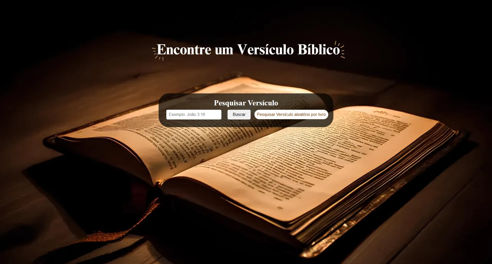
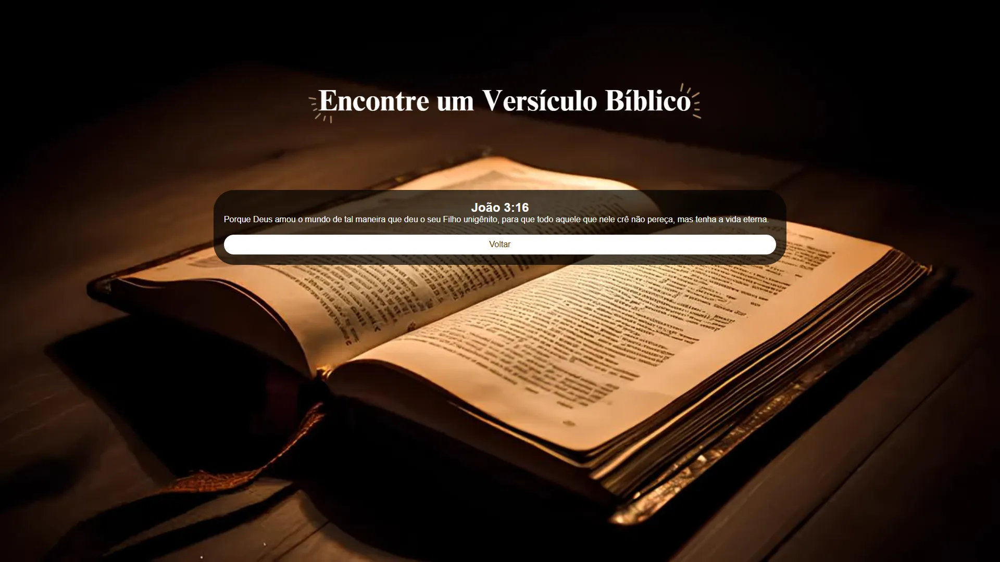
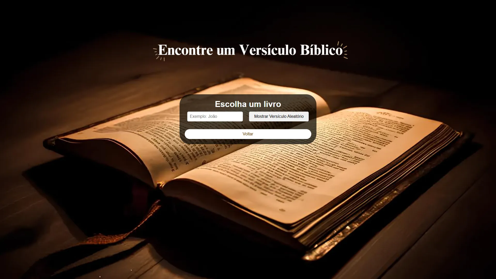
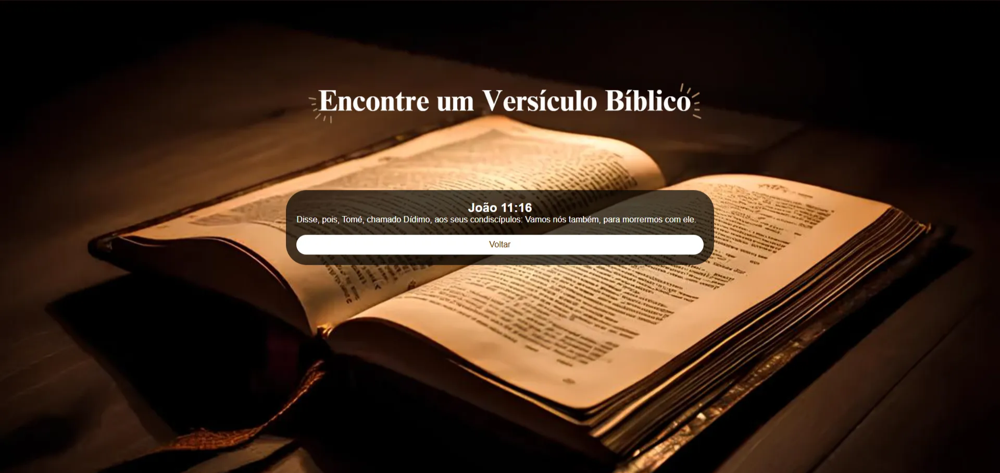

# API-BIBLIA 

## Sobre
Projeto para pesquisar um versículo da Bíblia ou sortear um versículo aleatório.
---

## Tecnologias utilizadas
- HTML
- CSS 
- JS
---

## Autor

- [Rebeka Marcelino do Prado](https://www.linkedin.com/in/rebekamarcelino)